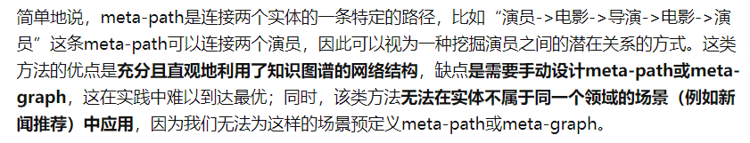

# Heterogeneous Graph Attention Network

## 问题

### Semantic-Level Attention

对于异构图来说，存在不同类型的边，但是不是每一条边都是我们想要的，将每一条边平等的对待会削弱一些具有更重要信息的边的占比，我们更多时候想要的是一些meta-path，但是meta-path的构建包括边的选择以及区分哪条边更重要这个问题是很难实现的

### Node-Level Attention

类似GAT的思想，对于不同的邻点来说，每个邻点都有不同的重要性，有的邻点包含更重要的信息，而有的邻点作用很小，如果都同等对待，也会导致削弱了一些具有更重要信息的边的占比

## 主要部件

1. given the node features as input, we use the type-specific transformation matrix to project different types of node features into the same space.（将不同类型的节点以及节点信息转化到同一空间的转化矩阵）
2. node-level attention
3. semantic/edge-level attention（meta-path）

## 补充

### meta-path（元路径）

