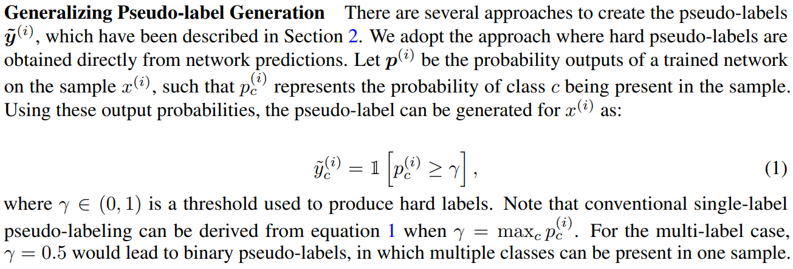
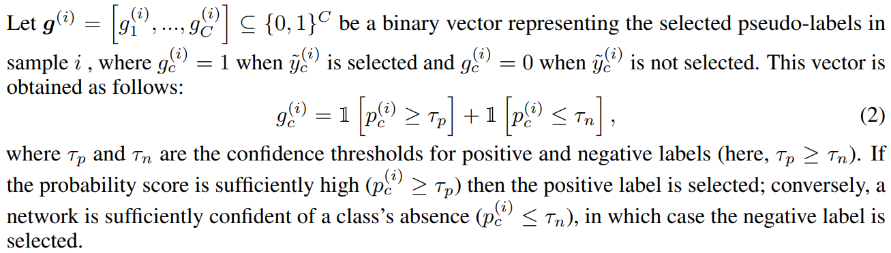
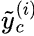
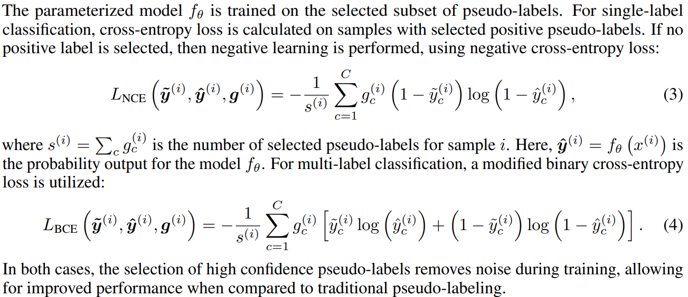
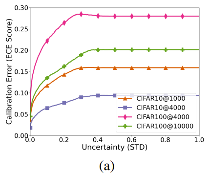
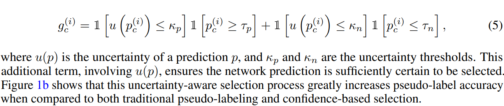
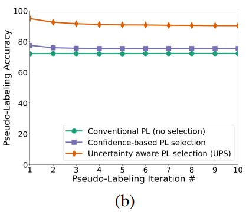
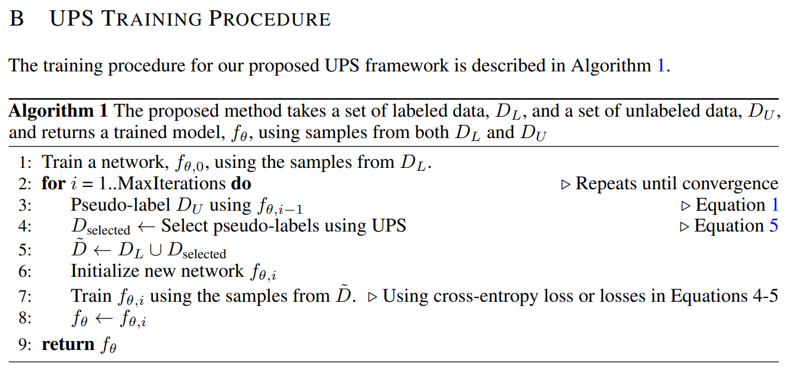
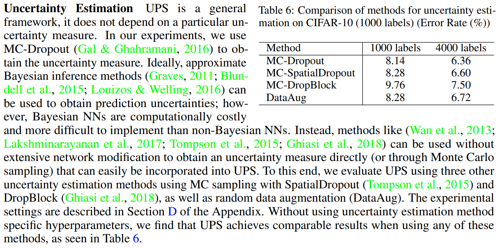

# IN DEFENSE OF PSEUDO-LABELING: AN UNCERTAINTY-AWARE PSEUDO-LABEL SELECTION FRAMEWORK FOR SEMI-SUPERVISED LEARNING

## 主要思想

We find that selecting predictions with low uncertainty greatly reduces the effect of poor calibration, improving generalization.置信度高的伪标签可以帮助提高模型的泛化能力

## Confidence-base Pseudo Label Selection

传统的半监督学习中，对于单标签问题，选择最大的作为输出的label，而多标签问题，设置γ为0.5使得可以产出多个标签

而本文在伪标签选择方法上进行创新，因为传统的方法中，因为阈值的原因，会导致引入很多错误的伪标签，将某些置信度很低的结果作为最后的伪标签，是非常不合理的，在这里引入正负标签(negative learning、Complementary Labels)的思想，以下为为样本i产生标签的方法，当某一类别的p大于等于给定上限阈值时，输出当前类别为正标签，而当某一类别的p小于等于给定下限阈值时，输出当前类别为负标签（负标签描述的是该样本不是什么类别），那么一个类别的输出就会产生三种结果，置信度高的为正标签，置信度低的为负标签，而置信度中等的不进行选择（不参与loss的计算）

对于损失函数来说，如下所示，如果给定样本具有正标签，那么计算正标签的cross entropy，如果没有正标签，则计算负标签的CE loss，计算公式如下，其中s为样本的伪负标签数，其中表示样本的伪标签

##  UNCERTAINTY-AWARE PSEUDO-LABEL SELECTION

虽然通过上诉方法降低置信度低结果导致的错误伪标签问题，但是对于校准差的网络来说，会存在置信度高的错误标签，其中网络的校准与预测的不确定性存在着很大的关系，预测的不确定性标准差、方差、熵等方式进行度量，论文中使用std进行度量，下图为这两者之间的关系，预测的不确定性越低，那么模型的Expected Calibration Error (ECE) score（描述网络校准情况）就越低，置信度高的伪标签的准确率越高

对此，论文在原来的选择函数上引入了描述不稳定性的变量，该方法大大的提高了结果的准确率

## 流程

算法流程如下，首先从有标签数据中抽部分样本来训练网络0，然后通过网络0预测伪标签并通过UPS的方法进行标签选择，选择后结合有标签数据进行新的网络的训练

## 不确定性评估

文中通过使用MC-dropout来进行不确定性评估，现成的dropout就是，使用dropout来训练模型时，模型的参数可以看成是服从一个伯努利分布（比如dropout radio =0.5，一种说法是：这层神经元中有一半会被dropout，换种说法就是——这层的每个神经元都有0.5的概率被dropout，这就是伯努利分布）。但是我们估计模型不确定度肯定是在训练好的模型上，也就是测试模型时估计的。所以我们只需要在预测的时候，仍然将dropout打开，预测 T 次，取预测的平均值就是最终的预测值。并且通过平均值就可以得到方差，这样就得到深度学习的不确定度了。这种方法也被称为MC-Dropout贝叶斯神经网络。

## Code

https://github.com/nayeemrizve/ups