# Pseudo-Label : The Simple and Efficient Semi-Supervised Learning Method for Deep Neural Networks

## 数据集

MNIST

## Deep Neural Network部分

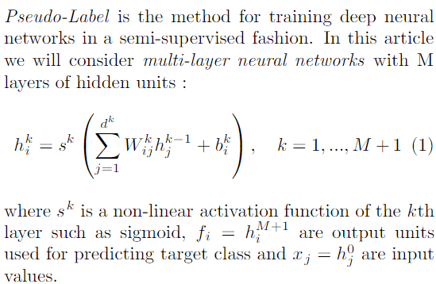

### Loss function

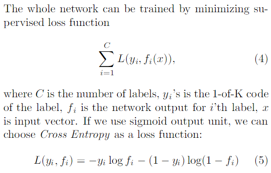

### Network Initial

通过DAE的方式，进行网络参数的初始化

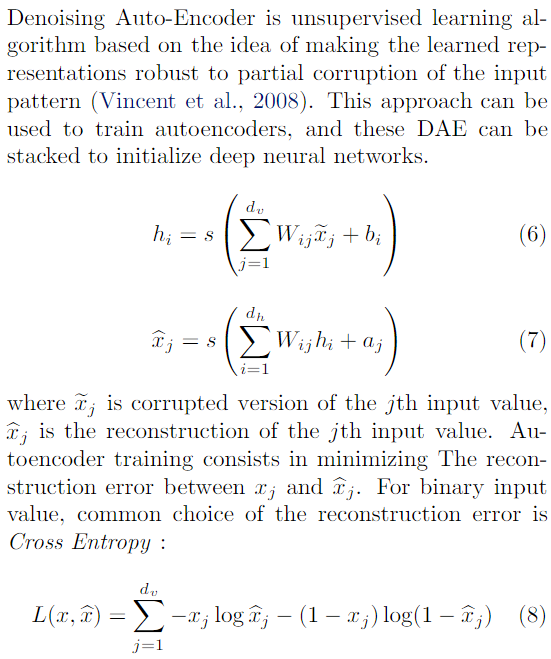

其中DAE的工作原理如下，主要思想为，**通过与非破损数据训练的对比，破损数据训练出来的Weight噪声比较小**并且**破损数据一定程度上减轻了训练数据与测试数据的代沟**，随机丢失部分特征可以增强泛化能力，DAE的loss function有两种，一种为计算向量之间的平方误差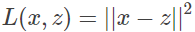，第二种为当每个维度都是位向量或者是位概率向量时，计算CE，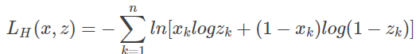

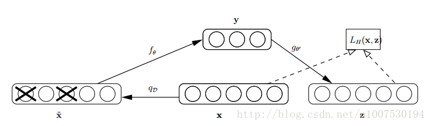

### Other Tricks

1. 1.SGD with dropout
2. 2.exponentially decaying learning rate and starts  at a high value
3. momentmum to speed up
4. 不使用regularization

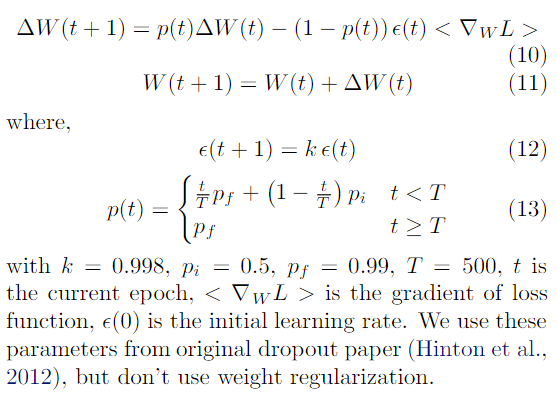

## Pseudo-Label

同时使用有标签数据和无标签数据训练模型，其中无标签数据的伪标签在每次更新权重后都进行重新计算，总的loss计算如下所示，其中因为有标签样本和无标签样本是不平衡的，所以需要引入参数a(t)来进行平衡（实际上a(t)描述无标签数据对结果的影响，太小的话无法利用无标签数据的价值，而太大的话会导致模型不准）

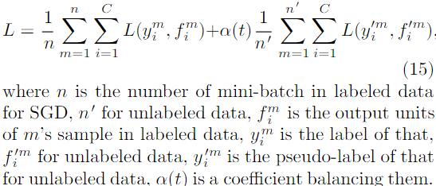

所以a(t)设置如下，模型初期训练时以有标签数据为主，而随着时间变化逐渐增大无标签数据的影响，到达某个时间时a(t)取固定值

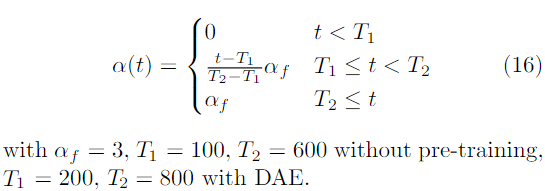

其中pseudo-label产生的方式如下，将最大的类别为1，其他为0，不使用软标签是因为软标签无法帮助模型改进

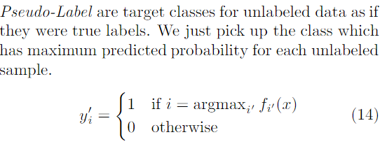

### Entropy Regularization

熵正则化主要用于描述半监督模型的损失情况，公式如下，主要思想时通过香农熵来描述类别重叠情况，其中公式中前半部分为有标签数据的MAP

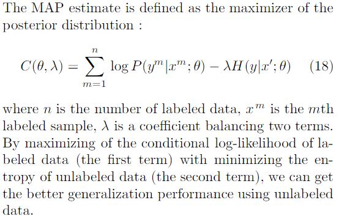

而后半部分描述的是无标签数据的预测类别的重叠情况，我们希望最后的模型会将数据归到某一个确定的标签（熵尽量的小），而不是多个标签都有很大的概率（熵大，没有明显的分类结果），本论文中的total loss和该思想是一致的，total loss前半部分是计算有标签的loss，而后半部分模型采用1-of-K的方式产出每一个无标签数据的每一类别的

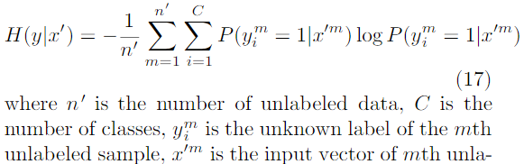

## Code

https://github.com/iBelieveCJM/pseudo_label-pytorch