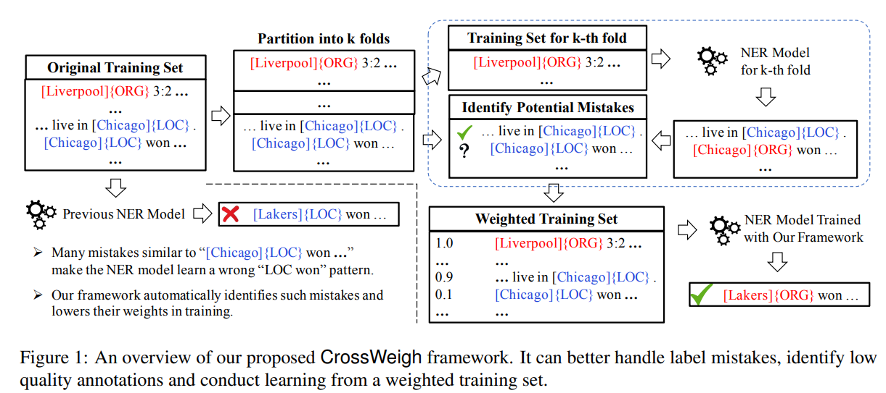

# CrossWeigh: Training Named Entity Tagger from Imperfect Annotations

## 主要思想

主要是用来评估ner数据集标注是否准确，主要思想参考kfold，但是进行kfold的时候，将用作测试集的那一部分中出现过的实体词语从训练集中剔除，那么进行预测的时候，模型面对的是以前没见过的实体词语，如果还是能预测对，那么就是准确的，如果预测和之前不一致，那么可能就是标注有问题，主要目的是想要尽量减少词本身的影响，让模型在专注于上下文的前提下，对词实体进行预测。

## CrossWeigh

具体内容如下，以往的ner模型因为标注问题（如下图中original training set里面最下面一条的Chicago应该指的是芝加哥公牛队，应该是ORG）导致，为了直接找出这样的潜在的错误，可以通过将训练集分成k份进行k fold，但是对训练集进行剔除测试集实体的处理，进行这样的处理后，用这个数据集训练出来的模型，如果对测试集预测后出现的结果与原结果不一致，则认为该语句标注可能出现问题，调整具有相同实体的语句的权重以及该语句的权重（指的是loss的权重）然后重复进行训练，最终用带权重的训练集训练出来的模型效果有有所提升，因为他更关注正确标注样本

